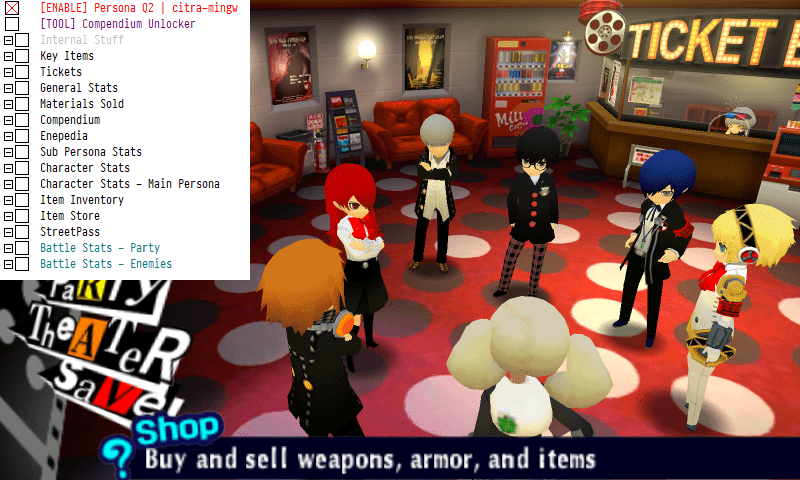

# Persona Q2 Cheat Table

A cheat table for **Persona Q2** @ Citra.

**WARNING:** Generally untested, use at your own risk.

**NOTE:** The table is mostly dynamically generated, opening certain group records for the first time can take a while.

## Prerequisites

* Latest Cheat Engine release
* Latest Citra release - from the *canary-mingw* branch
* Persona Q2 (`CTR-P-AQ2E`/`00040000001D7100`)

## Installation

1. Download and install Cheat Engine (or use the portable version).
2. Clone or download this repository.

## Usage

1. Open Citra and launch **Persona Q2**.
2. Open Cheat Engine and attach it to the Citra process.
3. Load the `citra-pq2.CT` table. If prompted, allow the main table script to run.
4. Enable the table via the `[ENABLE]` script at the top.
5. If you are also using the PQ2 MC Canon Names + Mod Support patch, enable the associated record.

---

## Table Contents

### Passive Effects

The **Passive Effect** is the currently active item effect when roaming the labyrinth.
For example, to avoid all random enemy encounters, set the passive effect to `4796` and freeze **Passive Effect Steps** to 50 or some other non-zero value.

### Play Time

**Play Time**, `t`, is measured using: `t = 30 * 60 * (60 * h + m)`, where `h` and `m` are the number of hours and minutes played respectively.

### Party Gauge

The **Party Gauge** appears to the right during each battle and is used for invoking Leader Skills.
The maximum meter level is 5 and each level is composed of 100 ticks, so 500 ticks will max out the meter.

### User Input Strings

**Names** and other user input strings in the game are SJIS encoded.
However, as long as no special chars are used, ASCII chars will also work.

### Compendium

You can use the **Compendium Unlocker** tool to unlock various personas in the compendium.
Pressing the `UNLOCK ALL` button will only unlock personas you haven't unlocked yet and will not overwrite your saved personas.
Pressing the `LOCK ALL` button will erase the entire compendium, *including any personas you've already unlocked*.

Use the records under the **Compendium** header to edit individual persona stats.

### Enepedia

Setting the value of records under this header to `FF FF` will reveal all enemy stats in the Enepedia.

### Inventory and Item Store

The items within the **Item Inventory** can only be edited via the table - adding and removing items is not supported.
To add an item, buy a cheap item and edit it via the table, or create the item in the **Item Store** and retrieve it from there.

### Battle Stats

**Battle Stats** allow you to edit character and enemy stats while in battle.
Note that these stats are dynamic and are only allocated by the game while in battle.

It's recommended **not** to freeze any of the values under these records.
